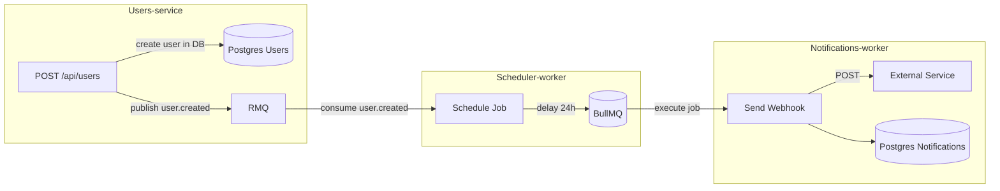

# Nebula Assignment

**Автор:** Herasymenko Oleh  
**Версія:** 1.0.0

---

## ⚙️ Підготовка оточення

1) Потрібно скопіювати змінні оточення з шаблону та відредагути їх під себе:
```bash
  cp .env.example .env
```

2) Обов’язково замінити WEBHOOK_URL на свій URL із https://webhook.site

> **docker compose автоматично підхоплює .env.**   
> Для локального запуску Prisma CLI може знадобитися вказувати DATABASE_URL інлайном (див. нижче).   


## 📂 ADR
[Директорія ADR проєкту](./adr/)


## 🚀 Запуск через Docker

Запуск усієї інфраструктури та сервісів:

```bash
  docker compose up --build
```

**Піднімаються сервіси:**
-	users_postgres — Postgres для Users
-	notifications_postgres — Postgres для Notifications
-	redis — Redis (BullMQ backend)
-	rabbitmq — AMQP брокер подій
-	app_users — Users Service (HTTP API)
-	app_scheduler — Scheduler (слухає RMQ, ставить відкладені задачі в BullMQ)
-	app_notifications — Notifications Worker (читає BullMQ, шле webhook, лог у БД)

**Відкриті Порти**
- Users API: http://localhost:3001
- RabbitMQ UI: http://localhost:15672 (логін/пароль з .env)
-	Postgres (users): localhost:5432
-	Postgres (notifications): localhost:5433
-	Redis: localhost:6379

## 🛠 Локальна розробка

1) Встановлення залежностей
```bash
  pnpm install
```

2) Обовʼязковий білд залежностуй (package):
```bash
  pnpm build
```

3) Запуск усіх сервісів у dev-режимі
```bash
  pnpm -r dev
```

4) Міграції Prisma (локально)

**Users:**
```bash
  DATABASE_URL="postgresql://${DB_USER}:${DB_PASSWORD}@${USERS_DB_HOST}:${USERS_DB_PORT}/${USERS_DB_NAME}?schema=public" \
pnpm --filter @app/users prisma migrate dev
```

**Notifications:**
```bash
  DATABASE_URL="postgresql://${DB_USER}:${DB_PASSWORD}@${NOTIFS_DB_HOST}:${NOTIFS_DB_PORT}/${NOTIFS_DB_NAME}?schema=public" \
pnpm --filter @app/notifications prisma migrate dev
```

## 🏗 Архітектура (мікросервісно)

-	Users Service (@app/users)
HTTP POST /api/users → зберігає користувача в Postgres → публікує подію user.created у RabbitMQ.
- Scheduler Service (@app/scheduler)
Слухає user.created з RabbitMQ → ставить відкладене завдання в BullMQ (Redis) на час PUSH_DELAY_HOURS.
-	Notifications Service (@app/notifications)
Читає задачі з BullMQ → шле POST на WEBHOOK_URL → зберігає результат у Postgres (статуси SCHEDULED/SENT/FAILED)
- - throttling і idempotency на Redis-ключах.
- Інфраструктура:
- - Redis (BullMQ), RabbitMQ (події), два окремих Postgres (users/notifications).

### Діаграма (Mermaid)



## API приклади

**Users Service**

**Create User**
```bash
  curl -X POST http://localhost:3001/api/users \
  -H 'Content-Type: application/json' \
  -d '{"name": "Oleh Herasymenko"}'
```
