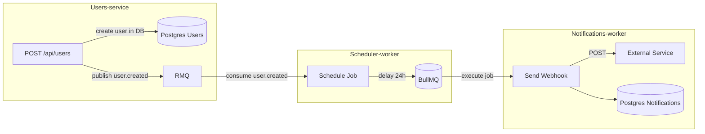

# ADR 0001: Архітектура системи керування користувачами та Push-нотифікаціями

**Статус:** IDEA  
**Автор:** Herasymenko Oleh  
**Дата:** 2025-08-30 - 2025-08-31

---

## Контекст
Тестове завдання: розробити систему мікросервісів для:
- Використовуй NestJS для розробки кожного мікросервісу. 
- Ти маєш надати можливість клієнту робити HTTP запит на створення користувача. 
- Потрібно зберігати дані користувача в базі даних (ім`я користувача). 
- Через 24 години після створення користувача потрібно відправити йому пуш. 
- Для імітації Push-сповіщень використовуй фейковий запит на зовнішній сервіс, наприклад можна використовувати https://webhook.site/ для генерації url.
- Твої мікросервіси не повинні прямо залежати один від одного. 
- Використовуй RabbitMQ та/або Redis, PostgreSQL або MySQL, NestJS.
- Результати заливати на GitHub, GitLab або щось схоже, на твій вибір. 
- Час на реалізацію до 3-4-х днів (враховуючи твою зайнятість).

### Driving forces
- **Слабка зв’язаність** між сервісами (event-driven).
- **Надійне планування відкладених задач** (delay, retry, rate-limit).
- **Простий developer experience** (швидкий запуск локально).
- **Прозорість**: метрики, логування, трасування.
- **Best practices**: конфіги через env, ідемпотентність, спільні пакети.

---

## Вимоги
1. **Users**:
   - REST API `POST /api/users`.
   - Збереження у Postgres.
   - Публікація події `user.created` у RabbitMQ.

2. **Scheduler**:
   - Споживає `user.created`.
   - Планує відкладену задачу (24 години) у BullMQ (Redis).
   - Retry/backoff, idempotency, rate-limit.

3. **Notifications**:
   - Виконує відкладені задачі з BullMQ.
   - Викликає WEBHOOK_URL (HTTP POST).
   - Аудит у БД, метрики Prometheus.

4. **Інфраструктура**:
   - RabbitMQ (події).
   - Redis (BullMQ) (scheduler + queue/task).
   - Postgres (користувачі |аудит нотифікацій).
   - Prometheus.
   - pnpm workspaces.

---

## Рішення

### 1. Поділ на сервіси
- **Users-service**: API + Postgres.
- **Scheduler-worker**: слухає події, планує задачі.
- **Notifications-worker**: виконує задачі, викликає webhook.

> **Альтернатива:** злиття Scheduler+Notifications.  
> **Вибір:** окремо → масштабованість і чіткий поділ відповідальностей.

### 2. Event-шина — RabbitMQ
- Users → Scheduler через RabbitMQ (topic exchange).

> **Альтернатива:** напряму писати в Redis.   
> **Вибір:** RMQ дає fan-out і незалежність для майбутніх звʼзаних сервісів на ті самі подіїї.

### 3. Відкладені задачі — BullMQ
- Scheduler створює delay-job.
- Notifications виконує (task worker).  

> **Альтернатива:** робити delay у RabbitMQ (TTL/DLX або delayed plugin).
> **Вибір:** BullMQ, бо має delay/retry/ backoff/ rate-limit із коробки. 

### 4. База даних
- Users: таблиця `User`.
- Notifications: таблиця `Notification` для аудиту.  

> **Альтернатива (Notification Svc only):**  Redis only.  
> **Вибір (Notification Svc only):** БД для ідемпотентності та audit trail.

### 5. Ідемпотентність і надійність
- CorrelationId як `jobId`.
- Redis lock (60с) для throttle.
- Rate-limit: 20 jobs/с.
- Retry/backoff: exponential.

### 6. Observability
- Prometheus `/metrics` у всіх сервісах.
- Метрики: `push_sent_total`, `push_failed_total`, `push_latency_seconds`.
- TraceId через RMQ → BullMQ → HTTP.
- Логи зі структурою.

### 7. Конфіги `.env`
- **Кореневий `.env`**: спільні параметри (Redis, RMQ, webhook).
- **Svc local `.env`**: лише `DATABASE_URL` для Prisma.
- `@app/config` читає обидва, підтримує префікси (`USERS_DB_*`, `NOTIFS_DB_*`).

### 8. Спільні пакети
- **@app/config** — валідація конфігів (Zod).
- **@app/rmq** — робота з RabbitMQ.
- **@app/contracts** — події/черги.

---

## Alternatives considered
- **Все через RabbitMQ** (з delayed plugin) → складніша експлуатація.  
- **Без БД для Notifications** → простіше, але втрата аудиту.  
- **Monolith service** → **Notification + Scheduler** => швидший старт, але без масштабованості.

----

## Візуалізація (Mermaid)
> Якщо рендер не спрацює в !!GitHub!!: [Mermaid Live Editor](https://mermaid.live/edit#pako:eNptUl1vmzAU_SvWfeokkvIRCuFhD133Mi1ZW1ZNGvTB4JvgFWxk7C1dyH-fAWVj2SzZsq_POffo2EcoJUNIYK9oW5GPj7kgdnSmmApPHapuYZfvvMTpbhhP2f2n9DO5pi2_NgPkmSwWb_tSIdVIhgrhgtzd9nZmV_ey03uF3aT25nmmM9JaU9S8q0bectJgPXncPExAFCwXF77SskJmalSLH1K9oPojaWmTFyk60-CFaJqdmeSDLGZO0pHEsKavxF9Vtj0y3mVXt6auNw9nz_-zspWa73hJNbcd_7UzyIzaeMDS2HS-yaIn2yy1WuQLFpWULzMf2xE7pNufb7P3B41K0Jqk0ztcwm3I21nKfxmaOQfHvjJnkGhl0IEGVUOHIxwHSA66wgZzSOyW4Y6aWueQi5OltVR8lbI5M5U0-wqSHa07ezIts9necWrjaH5XlW2I6p00QkPiB8EoAskRDpB4ob8MA38deEEYul60cuB1qHpLPw5uIjeK16t1GJ0c-Dl2dZeR665dP45jN_TcVXzjgI1VS7WZPu_4h0-_APJ-4Q8)

